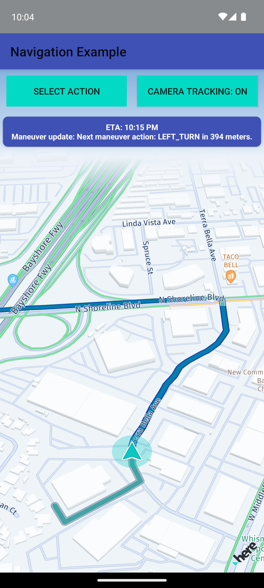

The Navigation example app shows how to calculate a route from A to B and how to start **turn-by-turn navigation** with voice commands. You can find how this is done in [NavigationExample.kt](app/src/main/java/com/here/navigation/NavigationExample.kt). It also shows how to set a tracking view when navigation is stopped.

**Note**: This is the same app as the "**Navigation**" app, but implemented in Kotlin instead of Java.

Features demonstrated:
----------------------

- **Route calculation**: Calculates a car route between two waypoints using the `RoutingEngine`.
- **Turn-by-turn navigation**: Uses the `VisualNavigator` with `startRendering()` to display a navigation arrow and guide the user along the route.
- **Voice guidance**: Provides localized maneuver instructions via the `EventTextListener` and a built-in TTS engine (`VoiceAssistant`). The preferred device language is automatically detected and matched against available voice skins.
- **Maneuver notifications**: Delivers `RouteProgressListener` updates including next maneuver action, remaining distance, ETA, and traffic delay. Supports turn angle and roundabout angle information.
- **Dynamic camera behavior**: Enables auto-zoom during guidance via `DynamicCameraBehavior` (or alternatively `SpeedBasedCameraBehavior`). The guidance frame rate is set to 60 fps for smooth rendering.
- **Location simulation**: Supports both real GPS positioning (`HEREPositioningProvider` with `LocationAccuracy.NAVIGATION`) and simulated route playback (`HEREPositioningSimulator`) for testing.
- **Map-matched location**: The `NavigableLocationListener` provides map-matched coordinates, wrong-way driving detection, and current speed information.
- **Map data prefetching**: Uses `RoutePrefetcher` (corridor-based) and `PolygonPrefetcher` (area-based) to download map data into the cache in advance for a smoother offline experience.
- **Dynamic routing**: Periodically searches for better traffic-optimized routes during guidance using the `DynamicRoutingEngine`. Configurable poll intervals and time-difference thresholds control how often alternatives are checked.
- **Live traffic updates**: Calls `calculateTrafficOnRoute` periodically to update traffic information displayed on the route polyline.
- **Electronic Horizon**: Retrieves road-ahead information based on the most probable paths. Note that ADASIS is not natively supported by the HERE SDK; this example shows how to use the Electronic Horizon features without conversion to the ADASIS data format.
- **Lane recommendation**: Optionally includes lane recommendation in maneuver notifications for supported roads.
- **Camera tracking toggle**: Allows the user to enable/disable camera tracking during guidance.

This example uses **HERE SDK Units** to support functionality such as permission handling or buttons that are not essential to the code snippets shown in this app, as the focus is on demonstrating how to use the APIs provided by the HERE SDK. The HERE SDK Units are included as AARs in the app's `libs` folder. For more details, see the "HERESDKUnitsKotlin" app to customize or create your own unit libraries. Note that this app is intended exclusively for the HERE SDK (Navigate). You can find it in the `navigate` folder. However, it can be easily adapted for the HERE SDK (Explore) by removing any code that is not supported there. At present, most components are compatible and will compile without issues.

Build instructions:
-------------------

1) Copy the AAR file of the HERE SDK for Android to your app's `app/libs` folder.

Note: If your AAR version is different than the version shown in the _Developer Guide_, you may need to adapt the source code of the example app.

2) Open Android Studio and sync the project.

Please do not forget: To run the app, you need to add your HERE SDK credentials to the `MainActivity.kt` file. More information can be found in the _Get Started_ section of the _Developer Guide_.
